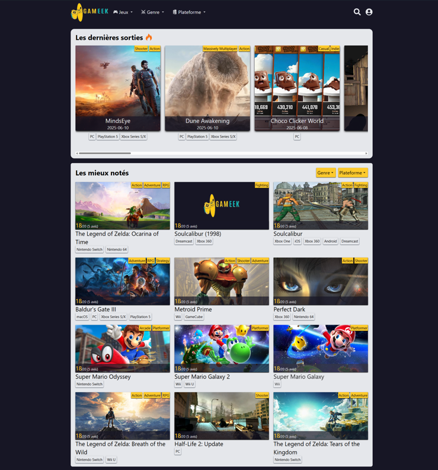

# Gameek

## About the project

I grew up with websites like jeuxvideo.com, which was my favorite video game site for news, reviews, and everything related to gaming. Gameek is a tribute to jeuxvideo.com.

The goal of this web application is to provide a space where the gaming community can share their reviews about the games they’ve played or their favorite titles. In Gameek, only community reviews matter, no professional critics, just honest and respectful opinions from players.

I'm currently in web development training, and this project is especially important to me as it’s my thesis project.

## Pictures

## Features

- Create an account and log in
- Write and submit reviews
- Browse a large selection of games with their details (description, genre, platforms ...)
- Check out the community’s favorite games in the “Les mieux notés” section

## Built with

- Typescript
- React
- Tailwind CSS

## How to start

- Clone the repository
- Install the dependencies with the following command : `yarn`
- Launch the project in your browser
